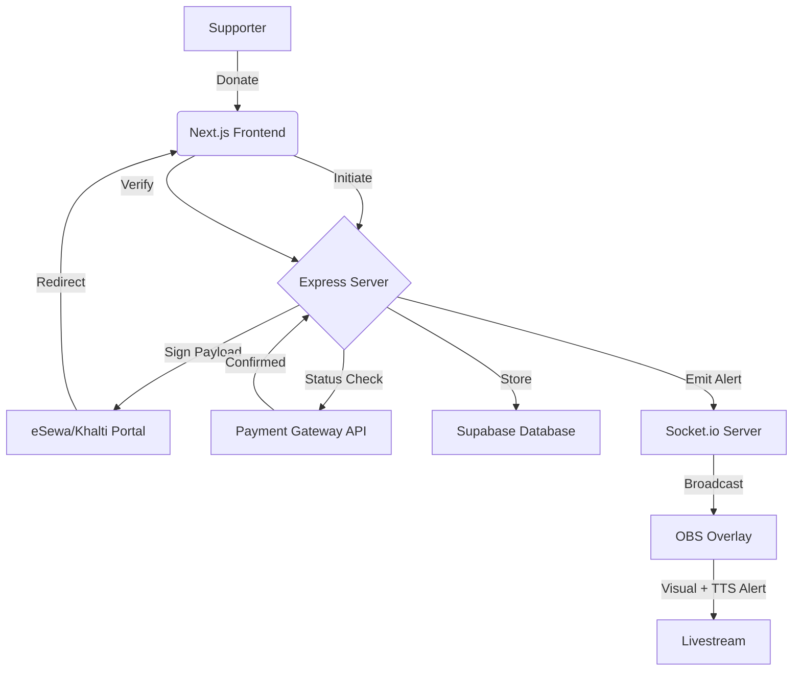

# SuperChat Nepal 🇳🇵

[](https://nextjs.org/)
[](https://nodejs.org/)
[](https://socket.io/)
[](https://opensource.org/licenses/ISC)
[](https://github.com/shubhamgyawali7/Superchat-Nepal/pulls)

> **The #1 real-time donation & superchat platform built exclusively for the Nepali streaming community.**

SuperChat Nepal empowers Nepali streamers to receive live donations from supporters using local payment gateways like **eSewa** and **Khalti**. It provides instant **OBS overlay alerts** with full visual customization, transforming the streaming experience into an interactive and rewarding venture.

---

## 🚀 Key Features

- **🇳🇵 Native Payment Integration** — Seamlessly receive payments through eSewa (v2) and Khalti.
- **⚡ Real-time OBS Alerts** — Ultra-low latency donation notifications via Socket.io.
- **🎨 Full Overlay Customization** — Control alert position, animation, colors, fonts, background, and border from your dashboard.
- **🖼️ GIF/Image Upload** — Upload custom alert GIFs or images directly from your device.
- **🗣️ Text-to-Speech** — Donor name and message read aloud with adjustable speed.
- **📊 Professional Dashboard** — Track earnings, manage donation history, and view supporter insights.
- **🏆 Top 5 Supporters Widget** — Persistent overlay showing top donors, sorted by amount.
- **📋 Recent Donations Overlay** — Live feed of recent supporters with configurable position and count.
- **🔐 Secure & Verified** — Server-side input validation and secure cookie-based auth.
- **🧪 Testing Suite** — Built-in "Test Alert" functionality to ensure your OBS setup is perfect before going live.

---

## 🛠️ Tech Stack

### Frontend
- **Framework:** Next.js 16 (App Router, Turbopack)
- **Styling:** Tailwind CSS 4
- **State Management:** Zustand
- **Real-time:** Socket.io Client
- **Auth:** Supabase Auth (SSR via `@supabase/ssr`)

### Backend
- **Runtime:** Node.js / Express 5
- **Real-time:** Socket.io
- **Database:** Supabase (PostgreSQL) with Row Level Security
- **Security:** Input sanitization, HTTP-only Cookies

---

## 🏗️ Architecture



---

## 📂 Project Structure

```bash
superchat/
├── client/              # Next.js frontend application
│   ├── src/app/         # Routes and Pages
│   │   ├── overlay/     # OBS overlay pages (main + top donations)
│   │   ├── dashboard/   # Streamer dashboard (settings, history, customize)
│   │   └── donate/      # Public donation pages
│   ├── src/components/  # Reusable UI components
│   ├── src/hooks/       # Custom React hooks (useAuth, useSocket, etc.)
│   ├── src/store/       # Zustand stores (alert queue)
│   └── src/lib/         # Supabase client helpers
├── server/              # Node.js/Express backend API
│   ├── src/controllers/ # Route handlers (auth, donations, streamer)
│   ├── src/middleware/   # Auth middleware
│   ├── src/routes/      # API route definitions
│   ├── src/utils/       # Payment utilities (eSewa)
│   └── schema.sql       # Full DB schema, triggers, RLS, indexes
└── docs/                # Documentation and assets
```

---

## 🎨 Overlay Customization

Streamers can fully customize their OBS overlay from **Dashboard > Settings**:

| Setting | Options |
|---|---|
| **Alert Position** | Top, Center, Bottom |
| **Alert Animation** | Slide, Bounce, Fade, Zoom |
| **Name Color** | Any hex color |
| **Amount Color** | Any hex color |
| **Message Color** | Any hex color |
| **Alert Background** | Any hex color |
| **Border Color** | Any hex color (defaults to theme) |
| **Font Family** | Any web-safe or Google Font |
| **Alert GIF/Image** | Upload from device (.gif, .png, .webp) |
| **TTS** | On/Off toggle |
| **TTS Speed** | 0.1x — 2x |
| **Recent Donations Position** | Bottom-Left, Bottom-Right, Top-Left, Top-Right |
| **Recent Donations Count** | 0–10 (0 to hide) |
| **Alert Duration** | 1–60 seconds |
| **Min Alert Amount** | NPR threshold for triggering alerts |

---

## ⚙️ Getting Started

### 1. Prerequisites
- Node.js **18.x** or higher
- Supabase account & project
- eSewa Merchant credentials

### 2. Installation

```bash
# Clone the repository
git clone https://github.com/shubhamgyawali7/Superchat-Nepal.git
cd Superchat-Nepal

# Install Server Dependencies
cd server && npm install

# Install Client Dependencies
cd ../client && npm install
```

### 3. Database Setup

Run `server/schema.sql` in your Supabase SQL Editor. This creates:
- `profiles` table (auto-created on signup via trigger)
- `donations` table
- Row Level Security policies
- Auto-update triggers for earnings
- Performance indexes
- Realtime subscriptions

### 4. Environment Configuration

#### Server (`server/.env`)
| Key | Description |
|---|---|
| `PORT` | Server listening port (default: 5000) |
| `SUPABASE_URL` | Your Supabase Project URL |
| `SUPABASE_SERVICE_ROLE_KEY` | Admin key for secure DB updates |
| `ESEWA_SECRET_KEY` | Your eSewa Merchant Secret |
| `ESEWA_PRODUCT_CODE` | Your eSewa Product Code |

#### Client (`client/.env.local`)
| Key | Description |
|---|---|
| `NEXT_PUBLIC_SUPABASE_URL` | Supabase Project URL |
| `NEXT_PUBLIC_SUPABASE_ANON_KEY` | Supabase Public Key |
| `NEXT_PUBLIC_SERVER_URL` | Backend API URL |

---

## 🛡️ Production Readiness

To deploy SuperChat Nepal for production:

1. **Security**: Ensure `NODE_ENV=production` is set to enable secure cookie flags and optimized builds.
2. **CORS**: Update `CLIENT_URL` and `SERVER_URL` to your production domains.
3. **Payment URLs**: Switch from `rc-epay.esewa.com.np` (sandbox) to `epay.esewa.com.np` (production).
4. **Scaling**: Use a process manager like **PM2** to manage your Node.js server.
5. **SSL**: Always serve both Frontend and Backend over HTTPS for secure payment redirects.

---

## 🗺️ Roadmap

- [x] **Top Supporters Widget** — Persistent overlay showing top donors, sorted by amount.
- [x] **Overlay Customization** — Full control over alert visuals, position, animation, and colors.
- [x] **GIF/Image Upload** — Upload custom alert images from your device.
- [x] **Text-to-Speech** — Donor name and message read aloud with adjustable speed.
- [ ] **Khalti Integration** — Full support for Khalti SDK and verification.
- [ ] **Multilingual Support** — Nepali/English interface toggle.
- [ ] **Mobile App** — Dedicated app for streamers to monitor alerts on the go.

---

## 📄 License

This project is licensed under the **ISC License** - see the [LICENSE](LICENSE) file for details.

---

<p align="center">
  Built with ❤️ for the Nepali Gaming Community
</p>
