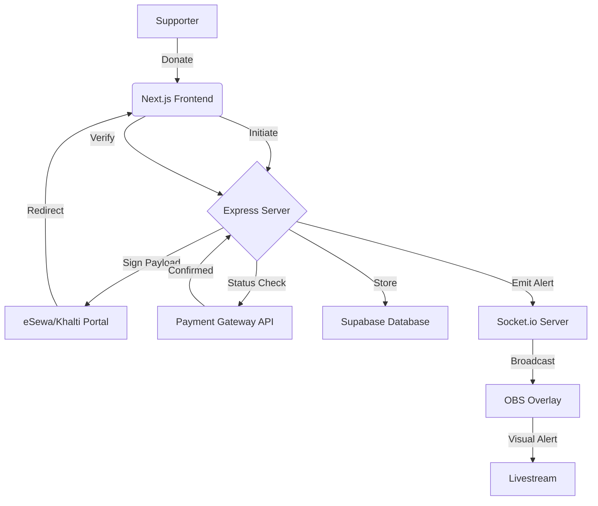

# SuperChat Nepal 🇳🇵

[](https://nextjs.org/)
[](https://nodejs.org/)
[](https://socket.io/)
[](https://opensource.org/licenses/ISC)
[](https://github.com/shubhamgyawali7/Superchat-Nepal/pulls)

> **The #1 real-time donation & superchat platform built exclusively for the Nepali streaming community.**

SuperChat Nepal empowers Nepali streamers to receive live donations from supporters using local payment gateways like **eSewa** and **Khalti**. It provides instant **OBS overlay alerts**, transforming the streaming experience into an interactive and rewarding venture.

---

## 🚀 Key Features

- **🇳🇵 Native Payment Integration** — Seamlessly receive payments through eSewa (v2) and Khalti.
- **⚡ Real-time OBS Alerts** — Ultra-low latency donation notifications via Socket.io.
- **📊 Professional Dashboard** — Track earnings, manage donation history, and view supporter insights.
- **🎨 Dynamic Customization** — Personalize your donation page and overlay themes to match your brand.
- **🔐 Secure & Verified** — Server-side HMAC-SHA256 signature verification for all transactions.
- **🧪 Testing Suite** — Built-in "Test Alert" functionality to ensure your OBS setup is perfect before going live.

---

## 🛠️ Tech Stack

### Frontend
- **Framework:** Next.js 15 (App Router)
- **Styling:** Tailwind CSS 4
- **State Management:** Zustand
- **Real-time:** Socket.io Client
- **Auth:** Supabase Auth (SSR)

### Backend
- **Runtime:** Node.js / Express
- **Real-time:** Socket.io
- **Database:** Supabase (PostgreSQL)
- **Security:** HMAC-SHA256, HTTP-only Cookies

---

## 🏗️ Architecture



---

## 📂 Project Structure

```bash
superchat/
├── client/          # Next.js frontend application
│   ├── src/app/     # Routes and Pages
│   ├── src/store/   # Global state (Zustand)
│   └── src/lib/     # Client-side helpers
├── server/          # Node.js/Express backend API
│   ├── src/routes/  # API endpoints
│   ├── src/models/  # Database schema (Supabase)
│   └── src/utils/   # Payment & Security utilities
└── docs/            # Documentation and assets
```

---

## ⚙️ Getting Started

### 1. Prerequisites
- Node.js **18.x** or higher
- Supabase account & project
- eSewa Merchant credentials

### 2. Installation

```bash
# Clone the repository
git clone https://github.com/shubhamgyawali7/Superchat-Nepal.git
cd Superchat-Nepal

# Install Server Dependencies
cd server && npm install

# Install Client Dependencies
cd ../client && npm install
```

### 3. Environment Configuration

#### Server (`server/.env`)
| Key | Description |
|---|---|
| `PORT` | Server listening port (default: 5000) |
| `SUPABASE_URL` | Your Supabase Project URL |
| `SUPABASE_SERVICE_ROLE_KEY` | Admin key for secure DB updates |
| `ESEWA_SECRET_KEY` | Your eSewa Merchant Secret |
| `ESEWA_PRODUCT_CODE` | Your eSewa Product Code |

#### Client (`client/.env.local`)
| Key | Description |
|---|---|
| `NEXT_PUBLIC_SUPABASE_URL` | Supabase Project URL |
| `NEXT_PUBLIC_SUPABASE_ANON_KEY` | Supabase Public Key |
| `NEXT_PUBLIC_SERVER_URL` | Backend API URL |

---

## 🛡️ Production Readiness

To deploy SuperChat Nepal for production:

1.  **Security**: Ensure `NODE_ENV=production` is set to enable secure cookie flags and optimized builds.
2.  **CORS**: Update `CLIENT_URL` and `SERVER_URL` to your production domains.
3.  **Payment URLs**: Switch from `rc-epay.esewa.com.np` (sandbox) to `epay.esewa.com.np` (production).
4.  **Scaling**: Use a process manager like **PM2** to manage your Node.js server.
5.  **SSL**: Always serve both Frontend and Backend over HTTPS for secure payment redirects.

---

## 🗺️ Roadmap

- [ ] **Khalti Integration** — Full support for Khalti SDK and verification.
- [ ] **Custom Sound Effects** — Allow streamers to upload custom mp3s for alerts.
- [ ] **Top Supporters Widget** — A persistent overlay showing top/recent donors.
- [ ] **Multilingual Support** — Nepali/English interface toggle.
- [ ] **Mobile App** — Dedicated app for streamers to monitor alerts on the go.

---

## 📄 License

This project is licensed under the **ISC License** - see the [LICENSE](LICENSE) file for details.

---

<p align="center">
  Built with ❤️ for the Nepali Gaming Community
</p>
